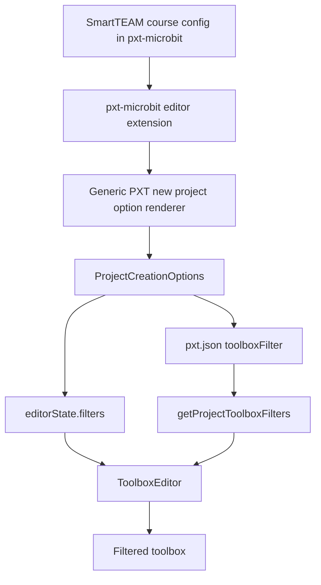

# Clean SmartTEAM Course Filtering Architecture

## Context

The current SmartTEAM course filtering implementation works, but part of the SmartTEAM-specific behavior was implemented directly in the local `pxt` core repository. That is not the cleanest long-term architecture.

The desired split is:

- `pxt` should contain only generic toolbox filtering and project creation support.
- `pxt-microbit` should contain all SmartTEAM-specific course definitions, block lists, labels, colors, and target UI configuration.

This document studies the existing MakeCode tutorial filtering mechanism and proposes a cleaner architecture for SmartTEAM course filtering that reuses the same concepts.

## How Tutorials Restrict Available Blocks

MakeCode tutorials do not remove APIs or package dependencies. They restrict the toolbox visually through runtime filters.

The main flow is:

1. Tutorial markdown is parsed in `pxt/pxtlib/tutorial.ts`.
2. Tutorial code snippets are collected from fenced blocks such as `block`, `blocks`, and `filterblocks`.
3. `pxt/webapp/src/tutorial.tsx#getUsedBlocksAsync()` decompiles those snippets to Blockly XML.
4. A headless Blockly workspace is used to inspect non-shadow blocks.
5. Each discovered block type is added to a `usedBlocks` map.
6. `pxt/webapp/src/app.tsx` converts that map into `editorState.filters`.

The tutorial whitelist is represented as:

```typescript
editorState.filters = {
    blocks: tutorialBlocks.usedBlocks,
    defaultState: pxt.editor.FilterState.Hidden
};
```

Because `FilterState.Visible` is `1`, the `usedBlocks[blockId] = 1` map acts as a whitelist. Blocks in the map are visible; everything else is hidden by `defaultState: Hidden`.

This is important for SmartTEAM: hidden blocks are only hidden from the toolbox. They remain available for decompilation and compilation if they already exist in the project.

## Where Tutorial Filters Are Defined

Tutorial filters are inferred from tutorial content rather than declared as a full explicit list.

Relevant sources:

- `pxt/pxtlib/tutorial.ts`
  - Parses tutorial markdown.
  - Recognizes fenced blocks including `block`, `blocks`, `filterblocks`, `blockconfig.local`, `blockconfig.global`, and `hiddennamespaces`.
- `pxt/webapp/src/tutorial.tsx`
  - Implements `getUsedBlocksAsync()`.
  - Decompiles snippets and computes the block whitelist.
- `pxt/webapp/src/app.tsx`
  - Applies tutorial filters to `editorState.filters`.
  - Calls `editor.filterToolbox()` to refresh the toolbox.

Tutorials also support category hiding through `hiddennamespaces`. The parsed namespaces are persisted into the project config as:

```json
"toolboxFilter": {
  "namespaces": {
    "someNamespace": "hidden"
  },
  "blocks": {}
}
```

That persistence path is implemented by `loadTutorialHiddenCategoriesAsync()` in `pxt/webapp/src/app.tsx`.

## Filter Data Structures

MakeCode currently uses two related filter formats.

### `ProjectFilters`

Runtime editor structure, defined in `pxt/localtypings/pxteditor.d.ts`:

```typescript
export interface ProjectFilters {
    namespaces?: { [index: string]: FilterState; };
    blocks?: { [index: string]: FilterState; };
    fns?: { [index: string]: FilterState; };
    defaultState?: FilterState;
}

export const enum FilterState {
    Hidden = 0,
    Visible = 1,
    Disabled = 2
}
```

This is what the toolbox reads at runtime.

### `toolboxFilter`

Persisted project/package config structure, defined in `pxt/localtypings/pxtpackage.d.ts`:

```typescript
toolboxFilter?: {
    namespaces: { [index: string]: "visible" | "hidden" | "disabled" },
    blocks: { [index: string]: "visible" | "hidden" | "disabled" },
}
```

This is saved in `pxt.json`.

`pxt/webapp/src/package.ts#getProjectToolboxFilters()` converts persisted `toolboxFilter` values into runtime `ProjectFilters`.

## Where Filters Are Applied

The toolbox applies filters in `pxt/webapp/src/toolboxeditor.tsx`.

Important methods:

- `shouldShowBlock(blockId, ns, shadow?)`
- `shouldShowCustomCategory(ns)`
- `getSearchSubset()`
- `getToolboxCategories()`

The filtering order is:

1. Block-level filter by block ID.
2. Block alias lookup through `blockIdMap`.
3. Namespace/category filter.
4. `defaultState`.

Shadow blocks are handled specially so required inputs inside visible blocks are not accidentally removed from flyout XML.

The Monaco toolbox has parallel filtering in `pxt/webapp/src/monacoFlyout.tsx`.

## Tutorial Block Config Is Separate

Tutorials also support `blockconfig.local` and `blockconfig.global`, but those are not the main whitelist mechanism.

`blockconfig.*` sections customize how blocks appear in the flyout by overriding the block XML. They are resolved in `pxt/webapp/src/app.tsx#loadTutorialBlockConfigsAsync()` and applied in `pxt/webapp/src/blocks.tsx#getBlockXml()`.

For SmartTEAM course filtering, the reusable mechanism is `ProjectFilters` plus `toolboxFilter`, not `blockconfig.*`.

## Can Tutorial Filtering Be Generalized for Courses?

Yes.

SmartTEAM course filtering should reuse the same model:

- Use `ProjectFilters` for immediate runtime toolbox state.
- Use `toolboxFilter` in `pxt.json` for persistence.
- Hide blocks/categories visually without removing packages or APIs.
- Keep hidden blocks available for compilation.

The main difference is how the filter is produced:

- Tutorials infer filters from tutorial code.
- SmartTEAM courses should declare filters explicitly in target-owned course configuration.

## Proposed Architecture



## Minimal Generic Changes Needed in `pxt`

The `pxt` repo should keep only generic changes.

### Keep: `ProjectCreationOptions.toolboxFilter`

`ProjectCreationOptions` should support:

```typescript
toolboxFilter?: pxt.PackageConfig["toolboxFilter"];
```

Reason:

- Allows any target, not just SmartTEAM, to create a project with a persisted toolbox filter.

### Keep: Pass Full New Project Options Through

`newUserCreatedProject()` should pass the complete object returned by the new project dialog into `newProject()`.

Reason:

- The previous implementation dropped fields other than `name` and `languageRestriction`.
- Generic target-provided options such as `filters` and `toolboxFilter` need to survive the creation flow.

### Keep: Persist `options.toolboxFilter`

`createProjectAsync()` should write `options.toolboxFilter` into the generated project config.

Reason:

- Course selection must survive reloads and saved project reopening.
- Persisting the filter in `pxt.json` matches existing tutorial `hiddennamespaces` behavior.

### Keep: Load Main Project `toolboxFilter`

`getProjectToolboxFilters()` should read `mainPkg.config?.toolboxFilter`, not only dependency filters.

Reason:

- Course filters are project-level policy.
- If a project has a saved course filter in its own `pxt.json`, the toolbox must apply it after reload.

### Keep: Hidden Namespaces for Custom Categories

`shouldShowCustomCategory()` should respect hidden namespace filters.

Reason:

- Some categories are special/custom and may not disappear just because all normal child blocks are hidden.
- A namespace marked `hidden` should be hidden consistently.

### Add: Generic New Project Option Contribution

The missing generic PXT feature is a way for targets to contribute required new project options without hardcoding target-specific UI in `pxt/webapp/src/projects.tsx`.

One possible generic type:

```typescript
interface NewProjectOptionGroup {
    id: string;
    label: string;
    required?: boolean;
    style?: "buttons" | "select";
    options: NewProjectOption[];
}

interface NewProjectOption {
    id: string;
    label: string;
    disabled?: boolean;
    projectConfig?: pxt.Map<any>;
    toolboxFilter?: pxt.PackageConfig["toolboxFilter"];
}
```

Then `ExtensionResult` or `appTheme` could expose:

```typescript
newProjectOptions?: NewProjectOptionGroup[];
```

The generic `NewProjectDialog` would render these option groups and merge the selected option into `ProjectCreationOptions`.

## What Should Move to `pxt-microbit`

All SmartTEAM-specific behavior should move out of `pxt`.

That includes:

- Course IDs such as `grade1` and `grade6`.
- Spanish labels such as `1º grado`.
- Enabled/disabled grade list.
- SmartTEAM block IDs.
- SmartTEAM namespace filters.
- SmartTEAM course metadata.
- Button layout details specific to course selection.

Recommended target-owned locations:

- `pxt-microbit/editor/extension.tsx`
- `pxt-microbit/pxtarget.json`
- `pxt-microbit/libs/smartteam-course-config/course-config.json`

The current `libs/smartteam-course-config/course-config.json` is a placeholder and can become the canonical course matrix.

## Recommended SmartTEAM Course Config Shape

Example:

```json
{
  "version": 1,
  "optionGroups": [
    {
      "id": "smartteamCourse",
      "label": "Selecciona el curso.",
      "required": true,
      "style": "buttons",
      "options": [
        {
          "id": "grade1",
          "label": "1º grado",
          "enabled": true,
          "projectConfig": {
            "smartteam": {
              "course": "grade1"
            }
          },
          "toolboxFilter": {
            "namespaces": {
              "basic": "hidden",
              "input": "hidden",
              "music": "hidden",
              "led": "hidden",
              "light": "hidden",
              "pins": "hidden",
              "functions": "hidden",
              "logic": "hidden",
              "Math": "hidden",
              "variables": "hidden",
              "text": "hidden",
              "arrays": "hidden",
              "addpackage": "hidden",
              "radio": "hidden",
              "serial": "hidden",
              "smartteamDigitalInputs": "hidden",
              "smartteamAnalogInputs": "hidden",
              "smartteamDisplay": "hidden"
            },
            "blocks": {
              "smartteam_control_if_then": "hidden",
              "smartteam_control_on_logo_pressed": "hidden",
              "smartteam_control_start_stopwatch": "hidden",
              "smartteam_control_stopwatch": "hidden",
              "device_while": "hidden",
              "smartteam_outputs_rgb_leds_color": "hidden",
              "smartteam_outputs_rgb_leds_rgb": "hidden",
              "smartteam_motors_robot_move": "hidden",
              "smartteam_motors_robot_move_speed": "hidden",
              "smartteam_motors_robot_stop": "hidden",
              "smartteam_motors_fan_control": "hidden",
              "smartteam_motors_servo_set_angle": "hidden",
              "smartteam_motors_servo_move_gradually": "hidden"
            }
          }
        },
        {
          "id": "grade2",
          "label": "2º grado",
          "enabled": false
        },
        {
          "id": "grade3",
          "label": "3º grado",
          "enabled": false
        },
        {
          "id": "grade4",
          "label": "4º grado",
          "enabled": false
        },
        {
          "id": "grade5",
          "label": "5º grado",
          "enabled": false
        },
        {
          "id": "grade6",
          "label": "6º grado",
          "enabled": true,
          "projectConfig": {
            "smartteam": {
              "course": "grade6"
            }
          },
          "toolboxFilter": {
            "namespaces": {
              "basic": "hidden",
              "input": "hidden",
              "music": "hidden",
              "led": "hidden",
              "light": "hidden",
              "pins": "hidden"
            },
            "blocks": {}
          }
        }
      ]
    }
  ]
}
```

## Why Use Explicit Hide Lists Instead of Allowed Lists?

Tutorials often use an allowlist:

```typescript
{
    blocks: allowedBlocks,
    defaultState: Hidden
}
```

For SmartTEAM courses, either model can work.

### Allowlist Advantages

- Easier to reason about course content.
- Safer for lower grades because new blocks are hidden by default.

### Allowlist Disadvantages

- Requires every visible built-in block and custom XML block to have a stable block ID.
- Built-in structural blocks can be harder to represent cleanly.
- Categories with custom behavior need extra handling.

### Hide List Advantages

- Matches the current implementation.
- Easier transition from the current full toolbox.
- Less likely to accidentally hide required structural blocks.

### Hide List Disadvantages

- New blocks may appear unless explicitly hidden.
- Lower-grade courses require ongoing audit when new blocks are added.

Recommendation:

- Keep the current hide-list model for the immediate cleanup.
- Consider moving to an allowlist model later once every SmartTEAM toolbox block has a stable block ID and custom XML blocks are represented consistently.

## Persistence Strategy

Persist course filtering in two layers:

1. `toolboxFilter` in `pxt.json`
   - Required.
   - Controls toolbox after reload.
   - Uses existing MakeCode package config shape.

2. Optional target metadata:
   - Example:

```json
"smartteam": {
  "course": "grade1"
}
```

This metadata is useful for showing the selected course later, migrations, analytics, or future course upgrade flows.

PXT core does not need to understand `smartteam.course`; it only needs to preserve unknown config fields.

## Keeping Hidden Blocks Available for Compilation

The architecture must not remove packages, namespaces, or APIs when changing courses.

The filter should only affect toolbox visibility:

- Hidden blocks remain valid if already present in a project.
- Existing projects still compile.
- Decompilation can still recognize existing blocks.
- A project can be reopened even if its course hides some blocks currently used in the workspace.

This matches tutorial behavior and avoids data loss.

## Avoiding SmartTEAM Hardcoding in PXT

Do not keep these in `pxt`:

- `SmartTeamCourseId`
- `SMARTTEAM_GRADE_1_FILTER`
- `SMARTTEAM_GRADE_6_FILTER`
- `SMARTTEAM_COURSE_OPTIONS`
- `smartTeamProjectFilters`
- Spanish SmartTEAM labels
- `smartteamCourse` as a first-class PXT field

Instead, `pxt` should only know that a target can contribute generic new project option groups.

The target decides:

- What the option means.
- How many choices exist.
- Which choices are disabled.
- Which `toolboxFilter` each choice contributes.
- Which target-owned metadata is stored.

## Recommended Minimal Set of PXT Changes

Keep or implement only:

1. Generic `ProjectCreationOptions.toolboxFilter`.
2. Generic `ProjectCreationOptions.projectConfig` or similar metadata bag.
3. Full pass-through from `askForProjectCreationOptionsAsync()` to `newProject()`.
4. `createProjectAsync()` persistence of `toolboxFilter`.
5. `createProjectAsync()` immediate use of runtime `filters`.
6. `getProjectToolboxFilters()` reading the main project `toolboxFilter`.
7. `shouldShowCustomCategory()` respecting hidden namespace filters.
8. A generic `ExtensionResult` or `appTheme` hook for new project option groups.

Remove or avoid:

1. SmartTEAM constants in `pxt/webapp/src/projects.tsx`.
2. SmartTEAM-specific fields in `pxt.editor.ProjectCreationOptions`.
3. Target-specific labels in generic PXT UI.

## Proposed Migration Plan

### Phase 1: Stabilize Generic PXT Support

- Keep generic project creation plumbing.
- Keep `toolboxFilter` persistence.
- Keep main project `toolboxFilter` loading.
- Keep hidden custom category handling.
- Add a generic new-project option contribution mechanism.

### Phase 2: Move SmartTEAM Data to pxt-microbit

- Move course definitions into `pxt-microbit`.
- Prefer `libs/smartteam-course-config/course-config.json` or `pxtarget.json`.
- Have `editor/extension.tsx` expose those definitions through the generic PXT hook.

### Phase 3: Remove SmartTEAM from PXT

- Delete SmartTEAM constants from `pxt/webapp/src/projects.tsx`.
- Replace `smartteamCourse` with generic metadata support.
- Keep `pxt` reusable for any target that wants a required new-project choice.

### Phase 4: Validate Behavior

For each enabled course:

1. Create a new project.
2. Verify the course selector is required.
3. Verify the generated `pxt.json` contains the expected `toolboxFilter`.
4. Verify the toolbox hides the expected categories and blocks immediately.
5. Reload the project and verify the same filtering persists.
6. Compile a project containing hidden blocks to confirm hidden APIs remain available.

## Final Recommendation

SmartTEAM course filtering should reuse the tutorial filtering model:

- `ProjectFilters` for runtime behavior.
- `toolboxFilter` for persistence.
- no API deletion.
- no package removal.

The key architectural cleanup is not a new filtering engine. The current filtering engine is sufficient. The cleanup is to move SmartTEAM-specific course definitions and labels out of `pxt` and into `pxt-microbit`, behind a small generic PXT extension/config hook for new project options.
